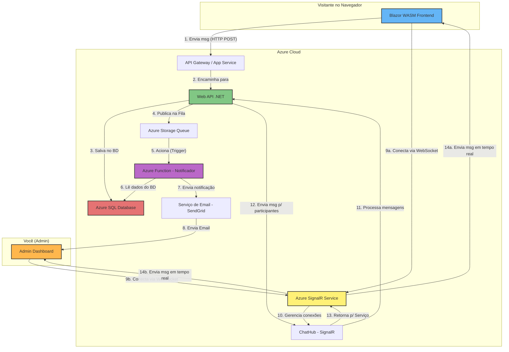

```mermaid
graph TD
    subgraph "Visitante no Navegador"
        A[Blazor WASM Frontend]
    end

    subgraph "Azure Cloud"
        B[API Gateway / App Service]
        C[Web API .NET]
        D[ChatHub - SignalR]
        E[Azure SignalR Service]
        F[Azure SQL Database]
        G[Azure Storage Queue]
        H[Azure Function - Notificador]
        I[Serviço de Email - SendGrid]
    end
    
    subgraph "Você (Admin)"
        J[Admin Dashboard]
    end

    %% Fluxo de Mensagem Padrão
    A -- 1. Envia msg (HTTP POST) --> B
    B -- 2. Encaminha para --> C
    C -- 3. Salva no BD --> F
    C -- 4. Publica na Fila --> G

    %% Fluxo de Notificação Assíncrona
    G -- 5. Aciona (Trigger) --> H
    H -- 6. Lê dados do BD --> F
    H -- 7. Envia notificação --> I
    I -- 8. Envia Email --> J

    %% Fluxo de Chat em Tempo Real
    A -- 9a. Conecta via WebSocket --> E
    J -- 9b. Conecta via WebSocket --> E
    E -- 10. Gerencia conexões --> D
    D -- 11. Processa mensagens --> C
    C -- 12. Envia msg p/ participantes --> D
    D -- 13. Retorna p/ Serviço --> E
    E -- 14a. Envia msg em tempo real --> A
    E -- 14b. Envia msg em tempo real --> J

    %% Estilos
    style A fill:#64b5f6,stroke:#333,stroke-width:2px
    style J fill:#ffb74d,stroke:#333,stroke-width:2px
    style C fill:#81c784,stroke:#333,stroke-width:2px
    style H fill:#ba68c8,stroke:#333,stroke-width:2px
    style F fill:#e57373,stroke:#333,stroke-width:2px
    style E fill:#fff176,stroke:#333,stroke-width:2px
```